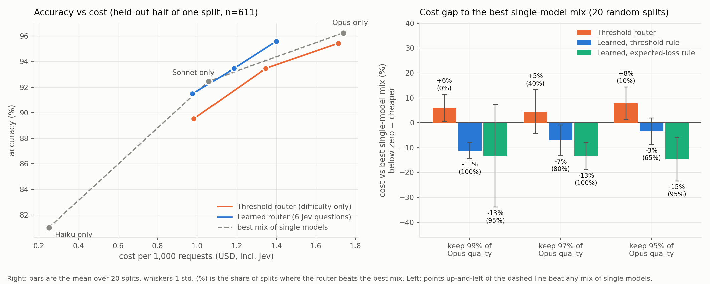

# jev-router

An outcome-based evaluation of [Jev](https://docs.typesafe.ai) (TypeSafe's typed "decision model")
as a cost-aware LLM router, on ground-truth multiple-choice benchmarks with three Claude tiers
(Haiku 4.5, Sonnet 5.5, Opus 5.5). Independent project; not affiliated with TypeSafe or Anthropic.

**Read the write-up: [docs/REPORT.md](docs/REPORT.md).**



## What it found (short version)

- A simple difficulty-threshold Jev router is **not reliably better** than the cheapest mix of
  single models at matched accuracy (worse in 9 of 9 operating points on the main sample; mixed on a
  fresh set).
- A **learned router using more of Jev's output** (six typed questions, full probability
  distributions, prompt length) beat that mix on the main sample (20-44% cheaper than always-Opus at
  91-96% accuracy; cheaper than the best single-model mix in 65-100% of 20 random splits) and on a
  **fresh set of 594 unseen items evaluated once with the router frozen** (7.5-12.3% cheaper than the
  best mix; the decision rule was written down before the run).
- The general result is **not specific to Jev**: TF-IDF and small-embedding routers with no Jev calls
  also beat single-model mixes. Jev's features gave the lowest cost on the original 1,220 items, but a
  **pre-registered replication on the fresh set did not confirm it** (Jev beat the best non-Jev router
  at 1 of 3 floors). What is robust is that routing on text features beats picking one model; Jev's own
  contribution is unresolved.
- Everything is multiple-choice; nothing here shows transfer to open-ended tasks. Full limitations
  are in the report.

## Method in one paragraph

Ground truth comes from RouterBench (answers recovered from correct-scoring responses) and MMLU-Pro.
Every item is answered by each of the three tiers once and graded by exact match of the final answer
letter (no LLM judge). Routing policies are tuned on a dev half to reach a quality floor (99/97/95% of
Opus accuracy) and scored on the held-out half, against always-one-model baselines, an oracle,
random and prompt-length routers with the same tier mix, and the cost-at-matched-accuracy frontier of
single-model mixes. The router's own Jev cost is charged. Confidence intervals are paired bootstraps,
and results are repeated over 20 random splits.

## Layout

```
src/jev_router/   client, typed questions, policies, evaluation, learned router, experiments
tests/            pytest suite (167+ tests, written test-first)
docs/REPORT.md    the write-up; docs/figures/  figures
data/results/     aggregated results (JSON)
samples/          item IDs of the evaluated samples (question text is not redistributed)
```

## Reproducing

```
pip install -e ".[dev]"            # add ".[ablation]" for the embedding baseline
# put JEV_API_KEY, ANTHROPIC_API_KEY, ANTHROPIC_WORKSPACE_ID in .env (git-ignored)
# download RouterBench (routerbench_0shot.pkl) and MMLU-Pro (test parquet) into data/raw/
python -m jev_router.build_samples
python -m jev_router.run_experiment --dry-run --cap 12
python -m jev_router.run_experiment --cap 12
```

Spending is capped: the response cache doubles as a cumulative ledger (default cap $12, hard limit
$14), and each call's worst-case cost is reserved before it starts. The published results cost about
$6.13 of Anthropic credit and about $0.14 of Jev. Model responses are cached locally (not published),
so re-scoring is free. Note: RouterBench is distributed as a pickle; inspect the file before loading it.

## Data and licenses

Code is MIT-licensed. Datasets keep their own licenses: MMLU-Pro (MIT) and RouterBench (see its
dataset card). Only item IDs are included here. Jev pricing used in the cost model ($0.042 per million
input tokens, output free) was supplied by the author and should be checked against current pricing.
