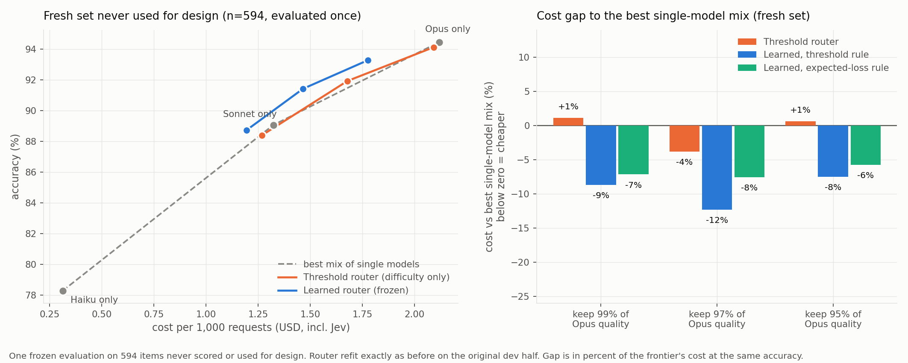

# Does a fast "decision model" make a good LLM router? An outcome-based evaluation of Jev

## Summary

Routing each prompt to the cheapest model that can answer it is a standard way to cut LLM
spend. [Jev](https://docs.typesafe.ai) (TypeSafe) is a small model that returns typed answers
(a choice, a score, a yes/no probability) with calibrated probabilities, and it is already being
used as a router. This project measures whether that actually saves money **without giving up
correct answers**, using real ground truth and three current Claude tiers.

Headline findings (multiple-choice benchmarks, Haiku 4.5 / Sonnet 5.5 / Opus 5.5):

1. **A simple Jev router (difficulty score plus thresholds) is not reliably better than the
   cheapest mix of single models.** On the main sample of 1,220 items it was more expensive than
   that mix at matched accuracy in all nine operating points (+4% to +40%). On a fresh set it was
   mixed (+1%, -4% and +1% on the combined set, and worse on RouterBench alone), so this
   negative result is itself unstable.
2. **A learned router that uses more of what Jev returns beat that mix, including on data never
   used for design.** Adding three yes/no questions ("would a small model be enough?", "a
   mid-size one?", "does this need expert knowledge?"), Jev's full probability distributions, task
   type and prompt length, and fitting a small logistic regression on the dev half only: on the
   main sample it costs 20-44% less than always-Opus at 91-96% accuracy (one split) and is cheaper
   than the best single-model mix in 65-100% of 20 random splits. On a **fresh set of 594 items
   with the router frozen and evaluated once**, it was 7.5% to 12.3% cheaper than the best mix at
   the same accuracy at all three quality floors, which meets the rule I wrote down before the run.
3. **The general result is not specific to Jev, and Jev's own contribution is not established.**
   Learned routers on TF-IDF or on a small sentence embedding, with no Jev calls, also beat the
   single-model mix. On the original 1,220 items Jev's features gave the lowest cost in 5 of 6
   rule-and-floor cells, and the lead did not shrink as training size grew from 100 to about 600
   items. But a **pre-registered replication on the fresh set did not confirm it**: under the
   expected-loss rule Jev beat the best non-Jev router at only 1 of 3 floors, with the embedding
   router ahead at the lower two. What is robust is that routing on text features beats picking a
   single model; whether Jev's features add to that is unresolved.
4. **"Correct answers per dollar" is the wrong headline metric here.** Haiku is so cheap that
   always-Haiku wins it by 4-5x over any router. The fair comparison is cost at matched accuracy.
5. Total spend: **$6.13** of Anthropic credit and about **$0.14** of Jev, with every response
   cached so all results re-score offline for free.


*Left: accuracy against cost on one held-out test half (n = 611); points up and to the left of
the dashed line beat any mix of single models. Right: cost gap to that best mix across 20 random
splits; below zero is cheaper. All routers' own Jev costs are included.*



*The same view on 594 fresh items never used for design, evaluated once with the frozen router.*

## 1. What already exists, and what this adds

Routing between models of different cost is well studied (RouterBench, SPROUT and LLMRouterBench
provide benchmarks; FrugalGPT, RouteLLM, Hybrid LLM and AutoMix are well-known methods). Using Jev
as the router is also already done: liteLLM published a
[Jev auto-router benchmark](https://docs.litellm.ai/blog/jev-auto-router-benchmark), and there is
an open-source [jev-router](https://github.com/rajdhakad9826/jev-router) library and a
[Bifrost feature request](https://github.com/maximhq/bifrost/issues/7278).

Those projects measure something narrower than what a buyer cares about. The liteLLM benchmark uses
80 prompts whose expected tiers were written by the authors without independent review, and scores
**agreement with those labels**; the authors themselves note this "does not prove that the selected
completion model can answer a request well". The jev-router repository reports no evaluation. This
project instead measures **downstream outcomes**:

- ground-truth answers (RouterBench and MMLU-Pro), not self-authored tier labels
- real accuracy and real dollars for three current Claude tiers
- policies tuned on a dev half and scored on a held-out half, with bootstrap confidence
  intervals and repeated random splits
- non-Jev routers with the same tier mix, so any gap is what Jev's information adds
- the router's own cost, and a comparison against the **single-model frontier** (see 3.3)

This project does not introduce a new routing algorithm. It is an evaluation, plus one
feature-engineering extension (Section 4.4). The related-work coverage was a handful of targeted
searches, not an exhaustive review.

## 2. Setup

**Data.** 800 items sampled from [RouterBench](https://huggingface.co/datasets/withmartian/routerbench)
(MMLU 500, ARC-Challenge 100, HellaSwag 100, Winogrande 100) and 420 items from
[MMLU-Pro](https://huggingface.co/datasets/TIGER-Lab/MMLU-Pro) (MIT license; 30 per each of 14
subject categories). RouterBench items were stratified into thirds by how often its 11 older
models answered correctly, so hard items are not drowned out. Both samples are deterministic
(seed 42) and reproducible from the public datasets; only item IDs are published here.

**Ground truth.** RouterBench has no answer column, but a response that scored 1.0 must have
chosen the true letter, so the answer is recovered from correct-scoring responses (at least two
agreeing, unanimous). Items that no old model answered correctly cannot be labelled and are
excluded, which removes the very hardest items. GSM8K was left out because its scores are rubric
grades (0.25 / 0.5 / 0.75), not correctness. MMLU-Pro ships exact answers.

**Models and settings.** Claude Haiku 4.5, Sonnet 5.5 and Opus 5.5, one call per (item, model),
`max_tokens` 4096, no system prompt, `effort: low` on Sonnet and Opus (Haiku does not accept it),
no fallbacks. List prices: $1/$5, $2/$10, $4/$20 per million input/output tokens.

**Grading.** Exact match of the final answer letter, no LLM judge. Models often ignore the
"print only a single choice" instruction and write an explanation ending in the letter (Sonnet did
so on 17 of 30 MMLU-Pro pilot items), so the grader reads the final stated answer. An earlier,
stricter grader marked those wrong and made Sonnet look worse than Haiku (40% vs 73%); fixing it
moved Sonnet to 83%. The old regular expression also had a bug, parsing "the answer is a strategy"
as answer "A". Both are covered by tests.

**Jev.** Version jev-1.13.0 through `https://api.typesafe.ai/v1/systemone`. The router uses one
call per prompt at $0.042 per million input tokens (output is free), about $0.00004 per prompt
(a figure supplied by the project owner and consistent with listed provider pricing; the billing
page itself was not checked). Mean latency was roughly 0.2 s per call, which is not counted in
the cost figures.

**Evaluation protocol.** Items are split 50/50 into dev and test by a hash of the item ID and a
seed. For each quality floor (99%, 97% or 95% of Opus's dev accuracy) the routing policy is tuned
on dev only to be the cheapest that reaches the floor, then scored once on the test half. Baselines:
always-Haiku, always-Sonnet, always-Opus, an oracle (cheapest correct model per item), routers with
the **same tier mix** assigned at random (exact expectation) or by prompt length, and the
**single-model frontier**: the cheapest random mixture of the three single models that reaches the
same accuracy. Confidence intervals are paired bootstraps over test items.

## 3. Results for the difficulty-threshold router

### 3.1 Is Jev's difficulty score related to real difficulty?

On the 800 RouterBench items, Jev's difficulty score correlates with how often the 11 older models
failed each item at Spearman rho = -0.42, against -0.13 for prompt length. This is much weaker
than the 91% tier agreement (rho 0.93) I got on 67 hand-labelled prompts in an early sanity check,
which is the gap between "matches labels I wrote" and "predicts real failures".

### 3.2 Model accuracy on the test half

| Strategy | Combined (n=611) | RouterBench (n=396) | MMLU-Pro (n=215) |
|---|---|---|---|
| Always Haiku | 81.0% | 89.1% | 66.0% |
| Always Sonnet | 92.5% | 95.2% | 87.4% |
| Always Opus | 96.2% | 97.7% | 93.5% |
| Oracle (perfect router) | 97.9% | 99.0% | 95.8% |

The oracle costs 69% less than always-Opus on the combined set, so routing has large headroom.

### 3.3 The threshold router against the frontier

Combined test half, one split. "Gap" is the router's cost above the cheapest single-model mixture
at the same accuracy.

| Floor | Jev accuracy | Cost (incl. Jev) | Saves vs Opus | vs same-mix random | vs same-mix length | Gap to frontier |
|---|---|---|---|---|---|---|
| 99% | 95.4% | $1.047 | 1% | +1.1 pp | +1.5 pp | +8% |
| 97% | 93.5% | $0.822 | 23% | +2.1 pp | +1.5 pp | +9% |
| 95% | 89.5% | $0.600 | 44% | +3.1 pp | +3.1 pp | +15% |

The savings against Opus are real, but the router loses to simply choosing cheaper single models
in every group (RouterBench, MMLU-Pro and combined, three floors each). Jev's own cost is small
(about $0.023 of $0.82), so this is not an overhead effect.

### 3.4 Robustness across 20 random splits

| Combined | Jev accuracy | Saves vs Opus | vs same-mix random | vs frontier (mean) | Splits cheaper than frontier |
|---|---|---|---|---|---|
| 99% | 94.6 +/- 0.6 | 5.1% | +0.6 pp | +6.0% | 0% |
| 97% | 92.3 +/- 1.1 | 27.2% | +1.1 pp | +4.5% | 40% |
| 95% | 90.3 +/- 1.4 | 39.2% | +1.9 pp | +7.8% | 10% |

The single-split advantage over uninformed routing was optimistic: across splits the interval
excludes zero in most splits only at the 95% floor (75% of splits against random, 60% against
length). The conclusion that this router does not beat the frontier holds.

### 3.5 Correct answers per dollar

| Strategy | Correct per $ (combined) |
|---|---|
| Always Haiku | 3,231 |
| Always Sonnet | 874 |
| Jev threshold router (97% floor) | 695 |
| Always Opus | 553 |

Always-Haiku dominates this metric because it is about 7x cheaper than Opus at a modest accuracy
cost, so no router that ever sends a prompt to a larger model can beat it. Accuracy at matched cost
(or cost at matched accuracy) is the meaningful comparison.

## 4. A richer Jev router

### 4.1 Why

The threshold router uses one number (the difficulty score). Jev returns much more, and asking it
better questions is nearly free.

### 4.2 Features and model

Three new yes/no questions (`small_ok`, `mid_ok`, `expert_needed`) are added to the original three,
for six questions per call (about 960 input tokens). Features are Jev's full distributions for
difficulty and task type, the per-tier probabilities, and log prompt length. For each of Haiku and
Sonnet a regularized logistic regression predicts whether that tier answers correctly. The
regularization strength and feature set are chosen by dev-only cross-validated log-loss;
thresholds are tuned on out-of-fold dev predictions to reach the quality floor. A second rule
(expected loss over predicted correctness and cost) is also evaluated. Nothing is tuned on the test
half. The extra Jev calls cost $0.049 in total (1,220 prompts), and no Anthropic calls were needed
because every model answer was already cached.

### 4.3 Results (one split, combined test half, n = 611)

| Floor | Accuracy | Cost (incl. Jev) | Saves vs Opus | vs same-mix random | Gap to frontier |
|---|---|---|---|---|---|
| 99% | 95.6% | $0.855 | 20% | +4.9 pp [+3.7, +6.2] | -13.6% |
| 97% | 93.5% | $0.725 | 32% | +6.1 pp [+4.4, +7.9] | -4.0% |
| 95% | 91.5% | $0.597 | 44% | +6.3 pp [+4.4, +8.2] | -1.2% |

### 4.4 Across 20 splits

| Router | Mean gap to frontier | Splits cheaper than frontier |
|---|---|---|
| Threshold router, 95-99% floors | +4.5% to +7.8% | 0-40% |
| Difficulty-only learned router | +2.3% to +4.6% | 5-35% |
| Full-feature learned router, threshold rule | -3.4% to -11.2% | 65-100% |
| Full-feature learned router, expected-loss rule | -8.7% to -14.6% | 95-100% |

One split at the 99% floor had the expected-loss router more accurate than Opus itself, which
leaves the frontier gap undefined; that split is excluded from its cell (19 splits). An earlier
version of this analysis scored it as -100%, which overstated the cell as -13.2% with a standard
deviation of 21 points; the corrected figure is -8.7% with a standard deviation of 5.5. No other cell
was affected.

The difficulty-only learned router stays above the frontier, so putting a learned model on the
single difficulty number does not help by itself; the gain needs additional information. Section 4.5
tests which information matters. In a per-dataset check on the single split (not repeated across the
20 splits), the full router beat that dataset's own frontier in 5 of 6 cells with one tie, which
suggests it is not merely telling the two datasets apart.

### 4.5 Ablation: is Jev the reason?

Any informative features might let a learned router beat single-model mixes, so the richer router
was compared with routers that use **no Jev output**, through the identical pipeline (dev-only
fitting, same floors and rules, the same 20 splits). Feature sets: prompt length only; TF-IDF (fit on
the dev half, 64 SVD components); a small sentence-embedding model (BAAI/bge-small-en-v1.5, 384
dimensions, run locally); Jev without length; Jev with length (the router above); and combinations.
Routers that use no Jev pay no routing cost; Jev routers pay the real six-question Jev cost.

Mean cost gap to the single-model frontier over 20 splits (negative is cheaper; in brackets, the
share of splits in which the router is cheaper than the frontier), combined set:

| Features | Threshold rule, 97% floor | Threshold, 95% | Expected-loss rule, 97% | Expected-loss, 95% |
|---|---|---|---|---|
| Prompt length only | +8.2% (5%) | +1.3% (20%) | +1.9% (15%) | -3.4% (60%) |
| TF-IDF | -4.6% (90%) | -4.7% (80%) | -5.3% (90%) | -5.7% (80%) |
| Embedding | -4.0% (70%) | +0.4% (50%) | -5.2% (85%) | -4.7% (70%) |
| Embedding + length | -3.6% (65%) | -0.4% (55%) | -5.3% (85%) | -4.1% (65%) |
| Jev, no length | -6.4% (75%) | -0.7% (40%) | -11.4% (95%) | -10.7% (95%) |
| **Jev + length (router above)** | **-7.0% (80%)** | **-3.4% (65%)** | **-13.4% (100%)** | **-14.6% (95%)** |
| Jev + length + embedding | -4.6% (80%) | +2.1% (35%) | -5.7% (90%) | -3.2% (55%) |

What this shows:

- **"A learned router beats single-model mixes" is not specific to Jev.** TF-IDF and embedding
  routers, which make no Jev calls, are also below the frontier in most splits. The general
  claim (routing on text features beats picking one model) stands on its own.
- **Length alone does not do it** under the threshold rule (above the frontier at the 97% floor in
  95% of splits), so length is not what drives the Jev router; Jev without length keeps most of
  the gain.
- **On the original 1,220 items, Jev's features gave the largest margin, but it depended on the rule.**
  Jev + length has
  the lowest mean gap in 5 of the 6 rule-and-floor cells (the 99% floor is omitted from the table
  and follows the same pattern: -11.2% threshold, -8.8% expected-loss). Under the expected-loss
  rule it is about 8 to 9 points cheaper than the best non-Jev router at the 97% and 95% floors
  (-13.4% vs -5.3%, -14.6% vs -5.7%). Under the threshold rule the margin is small (about 2 points at
  97%) and at the 95% floor TF-IDF is slightly ahead (-4.7% vs -3.4%).
- **On the original items, adding embedding vectors to Jev's features made the router worse, not
  better.** That is consistent with too many features for about 600 training items, and it means
  these data cannot say whether Jev's information is redundant with an embedding's. The fresh set
  showed the opposite (4.5.2), so this too is unsettled.

Caveats specific to this comparison: all routers were trained on about 600 items; the non-Jev
routers were given a wider regularization grid than the Jev router, which favours them; and the 20
splits reuse the same 1,220 items, so paired t-statistics are descriptive rather than inferential.
The next two subsections test whether the Jev margin survives more training data and unseen items.

#### 4.5.1 Learning curve

Each router was trained on 100, 200, 400 or all (about 607) items of the dev half of each of the 20
splits, and scored on that split's full test half (expected-loss rule; mean gap to the frontier,
share of splits cheaper in brackets):

| Features, floor | 100 items | 200 | 400 | about 600 |
|---|---|---|---|---|
| TF-IDF, 97% | +0.0% (25%) | -3.5% (70%) | -3.9% (80%) | -5.3% (90%) |
| Embedding, 97% | -1.8% (70%) | -3.1% (60%) | -5.3% (75%) | -5.2% (85%) |
| Jev + length, 97% | -3.7% (90%) | -8.0% (95%) | -9.2% (90%) | -13.4% (100%) |
| TF-IDF, 95% | +1.1% (40%) | -4.7% (70%) | -6.9% (80%) | -5.7% (80%) |
| Embedding, 95% | -2.9% (75%) | -3.9% (55%) | -5.2% (70%) | -4.7% (70%) |
| Jev + length, 95% | -1.0% (60%) | -8.5% (85%) | -7.8% (85%) | -14.6% (95%) |

On the original items no router caught up with the Jev router as training size grew, and its lead
under the expected-loss rule widened (about 2 points at 100 items to about 8 at full size at the
97% floor). Under the threshold rule the Jev router led clearly only at the 97% floor. The curve
stops at about 600 items, the most labelled data available, so it cannot show whether an embedding
router would overtake with thousands of examples. Subsets are nested and splits reuse the same
items, so this is descriptive.

#### 4.5.2 Pre-registered replication on the fresh set: not confirmed

The same routers were fit exactly as for the seed-42 split, frozen, and applied once to the 594
fresh items. The rule was written into the code before any number was computed: Jev's margin holds
if, under the expected-loss rule, Jev + length has a lower gap to the fresh set's own frontier than
the best non-Jev router at 2 of the 3 floors. Combined fresh set, gap to the frontier (negative is
cheaper):

| Features | Expected-loss 99% | 97% | 95% | Threshold 99% | 97% | 95% |
|---|---|---|---|---|---|---|
| Length only | +0.0% | -2.9% | -2.9% | +0.0% | -3.6% | +0.1% |
| TF-IDF | -0.1% | -2.4% | -11.8% | -0.6% | -3.1% | -5.6% |
| Embedding | -1.4% | -8.4% | -17.0% | -5.6% | -11.0% | -13.9% |
| Embedding + length | -1.4% | -8.4% | -18.1% | -5.8% | -10.3% | -14.0% |
| Jev, no length | -4.8% | -0.4% | -1.8% | -5.1% | -14.8% | -4.6% |
| **Jev + length** | **-7.2%** | **-7.6%** | **-5.8%** | **-8.7%** | **-12.3%** | **-7.5%** |
| Jev + length + embedding | -1.5% | -14.7% | -17.5% | -7.1% | -14.2% | -10.2% |

**The rule was not met: Jev + length won 1 of 3 floors (99%).** At 97% the embedding router was
slightly cheaper (-8.4% vs -7.6%) and at 95% far cheaper (-17.0% vs -5.8%). Under the threshold rule
(not the pre-registered one) Jev + length beat the best non-Jev router at 99% and 97% by about 3 and
1 points and lost clearly at 95%. The reproduction check passed: Jev + length with the threshold rule
matches the fresh-set numbers in 4.6 exactly. Adding embeddings to Jev's features, which hurt on the
original items, gave among the cheapest routers here (-14.7% and -17.5% at the lower two floors under
the expected-loss rule), so the two information sources are not simply redundant; with 594 items the
difference from the original-set finding could be noise. Every non-trivial router still beat the
frontier at most cells, and length alone stayed near zero.

An exploratory observation, found after the fact and not pre-registered: broken out by dataset under
the expected-loss rule, Jev + length was below the fresh frontier in all six dataset-by-floor cells
(-4.7% to -16.9%), while the embedding router ranged from +0.7% (RouterBench, 95% floor) to -21.0%
(MMLU-Pro, 95% floor). Jev may be more consistent across datasets than an embedding router, but this
is not established.

### 4.6 A fresh set, evaluated once

The question wording and the router were developed while looking at the seed-42 dev half, so the
other 19 splits share about half their data with what was tuned on. To remove that concern I drew
**594 fresh items never scored or used for design** (300 RouterBench and 294 MMLU-Pro, disjoint
from the original 1,220), froze the questions, features, regularization grid and routing code, refit
the router exactly as before on the original dev half (the refit reproduces the recorded seed-42
test numbers), and evaluated once. The decision rule was written into the code before any paid
call: the frozen router "holds" if its cost gap to the fresh set's own single-model frontier is
below zero at 2 of the 3 quality floors.

Single-model accuracy on the fresh set: Haiku 78.3%, Sonnet 89.1%, Opus 94.4%.

| Combined (n=594) | Accuracy | Cost (incl. Jev) | Saves vs Opus | Gap to frontier | vs same-mix random | vs same-mix length |
|---|---|---|---|---|---|---|
| Learned router, 99% floor | 93.3% | $1.055 | 16% | -8.7% | +4.5 pp [+3.1, +5.8] | +2.9 pp [+1.0, +4.9] |
| Learned router, 97% floor | 91.4% | $0.870 | 31% | -12.3% | +6.2 pp [+4.4, +8.0] | +5.1 pp [+2.5, +7.7] |
| Learned router, 95% floor | 88.7% | $0.709 | 44% | -7.5% | +6.0 pp [+4.1, +8.1] | +5.4 pp [+2.7, +8.2] |
| Threshold router (old), 99% / 97% / 95% | 94.1% / 91.9% / 88.4% | $1.242 / $0.997 / $0.752 | | +1.1% / -3.9% / +0.6% | | |

**Verdict against the pre-registered rule: holds** (below zero at all three floors). Per dataset
the gap is -10% to -19% on the fresh RouterBench items and -3.5% to -9.4% on the fresh MMLU-Pro
items. The expected-loss rule is also below the frontier in every group and floor.

Two honest observations. First, the old threshold router was not consistently above the frontier
on the fresh set (it is +18% and +27% on RouterBench alone at the lower two floors, but below the
frontier at the lower two floors on MMLU-Pro), so its failure on the main sample was less stable
than it looked.
Second, the fresh items come from the same benchmarks, so this shows that the result is not an
artifact of the seed-42 design, not that it transfers to other kinds of tasks.

## 5. Limitations and how to read the results

- **Only multiple-choice questions.** Open-ended generation, code, tool use and long contexts are
  not tested; nothing here says the router transfers to them.
- **Sample construction.** RouterBench items were stratified by old-model pass rate and exclude
  items no old model answered correctly, so absolute accuracies are not comparable to published
  benchmark numbers. RouterBench prompts are answerable by all three tiers most of the time, which
  limits routing headroom there.
- **Design leakage (largely addressed).** The extra questions were designed after exploring the dev
  half of the seed-42 split (at most 100 items), so the other 19 splits are not independent of the
  design. The fresh-set evaluation (4.6) removes this for the router as a whole. The pre-registered
  replication of the ablation on the fresh set (4.5.2) did not confirm Jev's margin over embedding
  routers, so that margin is unresolved.
- **Instability.** Split-to-split standard deviations of the frontier gap are about 3 to 9 points,
  the threshold-rule advantage at the 95% floor is only a few percent, and at the 99% floor one split
  had the router more accurate than Opus, leaving its frontier gap undefined (excluded; see 4.4).
- **Provider settings shape cost.** `effort: low` and Sonnet's verbosity affect its cost; results
  depend on these settings and on list prices at the time of the run.
- **Latency is not part of the cost model.** Jev adds roughly 0.2 s per request.
- **Prompt length is a feature** in the learned router, which can encode dataset identity; the
  per-dataset check above suggests this does not explain the result, but it is a risk.
- **Single grader, single run.** Model answers are single samples with no repeated calls.

## 6. Reproducing

Only IDs are published (`samples/`), not benchmark text. Download RouterBench
(`routerbench_0shot.pkl`, scan it before unpickling) and MMLU-Pro (`test-00000-of-00001.parquet`)
into `data/raw/`, then:

```
pip install -e ".[dev]"
python -m jev_router.build_samples                      # rebuilds the exact 1,220-item sample
python -m jev_router.run_experiment --dry-run --cap 12  # projected cost
python -m jev_router.run_experiment --cap 12            # calls Jev and Anthropic, cached
python -m jev_router.multi_split                        # 20-split robustness
python -m jev_router.router_v2_experiment --phase full  # richer router (needs Jev calls)
python -m jev_router.router_v2_multi_seed               # 20-split check of the richer router
python -m jev_router.ablation --seeds 20                # no-Jev baselines (uses a local embedding model)
python -m jev_router.fresh_heldout --project-only      # then without the flag for the fresh-set run
python -m jev_router.learning_curve                    # learning curve, no API calls
python -m jev_router.ablation_fresh                    # frozen ablation routers on the fresh set
python -m jev_router.make_figures
```

Keys go in `.env` (`JEV_API_KEY`, `ANTHROPIC_API_KEY`, `ANTHROPIC_WORKSPACE_ID`), which is
git-ignored. Spending is capped: the response cache doubles as a ledger, the cap is cumulative
across runs (default $12, hard limit $14), and each call's worst-case cost is reserved before it
starts. Every Claude and Jev response is cached on disk (not published) so `--offline` re-scoring is
free. The test suite has 153 tests.

## 7. Cost of the study

Anthropic: $6.13 in total ($3.90 for the main 1,220 items and $2.23 for the 594 fresh items). Jev: about $0.14 (1,220 calls for the threshold router, 1,220 for the richer
router, about 100 exploratory calls, and 594 + 594 calls for the fresh items).
